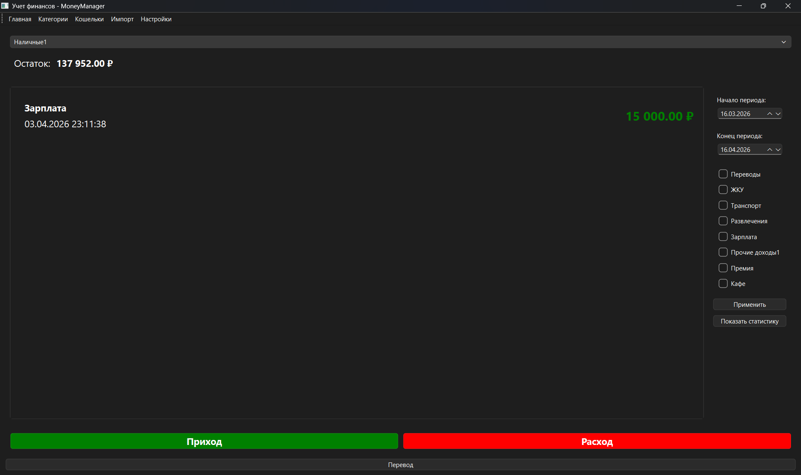

# Приложение для учета финансов MoneyManager

> Приложение разрабатывалось в рамках курсовой работы

- Графический интерфейс
- SQLite БД

## Фичи:
- Кошельки
- Приход/Расход
- Переводы между кошельками
- Категории трат
- Защита входа по паролю
- Импорт из CSV

## Установка и запуск

1. `install.cmd` - установит зависимости
2. `start.cmd` - запускает программу

> Пароль по умолчанию: `1234`
